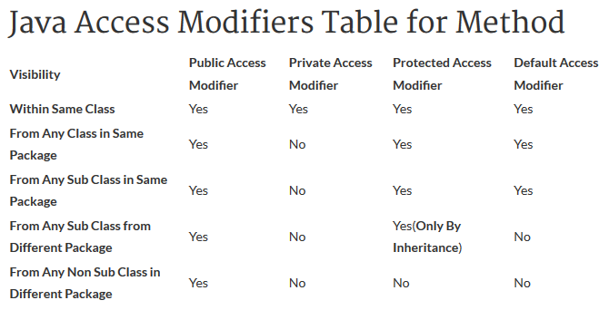

java
====

Contents
--------

## Objects and classes

An __object__ can be considered a "_thing_" that can perform a set of related activities. In OOP terms an object is an instance of a class.

A __class__ is the template that describe the details of an object.

The following is a Java class named _Bicycle_:

<!-- language: java -->

    public class Bicycle {

    int cadence = 0;
    int speed = 0;
    int gear = 1;

    void changeCadence(int newValue) {
         cadence = newValue;
    }

    void changeGear(int newValue) {
         gear = newValue;
    }

    void speedUp(int increment) {
         speed = speed + increment;   
    }

    void applyBrakes(int decrement) {
         speed = speed - decrement;
    }

    void printStates() {
         System.out.println("cadence:" +
             cadence + " speed:" + 
             speed + " gear:" + gear);
    }
    }

A new object of the _Bicycle_ class can be instantiated using the following statement: 

    Bicycle bike = new Bicycle();
    
## Access modifiers

### Access modifiers for class

* Classes in Java can use only __public__ and __default__ access modifiers.
* When set to __public__, the given class will be accessible to all the classes available in Java world.
* When set to __default__, the given class will be accessible to the classes which are defined in the __same package__.

### Access modifiers for variable

* Variables in Java can use the following access modifiers: __default__, __private__, __protected__, __public__.
* If a variable is set to __default__, it will be accessible to the classes which are defined in the same package. 
* If a variable is set to __public__ it can be accessible from any class available in the Java world.
* If a variable is set to __protected__ inside a class, it will be accessible from its sub classes defined in the same or different package only via Inheritance.
* A variable if defined __private__ will be accessible only from within the class it is defined.

### Access modifiers for method

* Methods in Java can use the following access modifiers: __default__, __private__, __protected__, __public__.
* When a method is set to __default__ it will be accessible to the class which are defined in the same package.
* When a method is set to __public__ it will be accessible from any class available in the Java world.
* If a method is set to __protected__ inside a class, it will be accessible from its sub classes defined in the same or different package.
* A method if defined __private__ will be accessible only from within the class it is defined. 

## Non-access modifiers

### Static keyword

### Final

Final modifiers are applicable to:
* Class : A class when set to final __cannot be extended__ by any other class
* Method : A method when set to final __cannot be overridden__ by any subclass
* Variable : When a variable is set to final, its value __cannot be changed__. Final variables are like constants.

### Abstract

Abstract modifiers are applicable to:
* Class
* Method

#### Abstract class

* An abstract class can have abstract methods.
* A class can also be an abstract class without having any abstract methods in it. 
* If a class has an abstract method, the class becomes an abstract class.

#### Abstract methods

* Abstract methods do not have an implementation.
* Abstract methods have only a signature (they don't have body).

## Interfaces
* Interfaces can be defined with __interface__ keyword.

<!-- language: java -->
    public interface MyInterface
    {
    int i=0;
    public void Height(int height);
    public abstract void setHeight();
    }
    
* All Interface methods are implicitly __public__ and __abstract__.
* Interfaces can declare only __constants__. Instance variables are not allowed. It means all variables inside an Interface must be __public, static, final__. Variables inside interface are implicitly public static final.
* Interface methods can not be static.
* Interface can _extend_ one or more other interface.

## Polimorphysm

## Variables

### Local variables

### Instance variables

### Reference variables

## Constructors

## Packages

## String class

